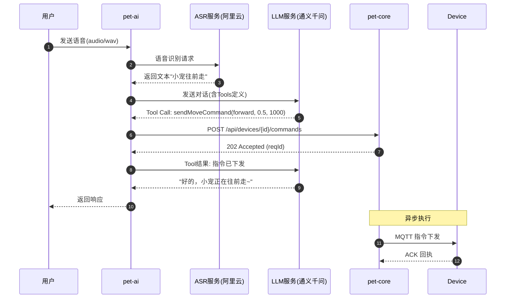
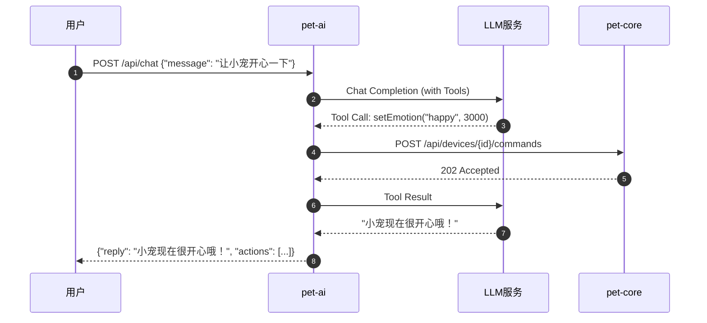

# pet-ai 模块规划文档

## 1. 文档信息

* **模块名称**：pet-ai（语音智能控制模块）
* **版本**：V0.1（规划阶段）
* **日期**：2026-01-24
* **目标**：实现自然语言（语音）-> 大模型处理 -> 行为指令 -> 设备执行的完整链路

---

## 2. 项目现状概述

### 2.1 现有架构

```
┌──────────────────────────────────────────────────────────────┐
│                       DeskPet 系统                            │
├──────────────────────────────────────────────────────────────┤
│                                                              │
│   ┌─────────────┐    HTTP     ┌─────────────┐              │
│   │   Console   │ ──────────> │  pet-core   │              │
│   │  (控制台)    │             │ Spring Boot │              │
│   └─────────────┘             └──────┬──────┘              │
│                                      │                      │
│                               Internal HTTP                  │
│                                      │                      │
│                               ┌──────▼──────┐              │
│                               │mqtt-gateway │              │
│                               │   Vert.x    │              │
│                               └──────┬──────┘              │
│                                      │                      │
│                                    MQTT                     │
│                                      │                      │
│                               ┌──────▼──────┐              │
│                               │   Device    │              │
│                               │   ESP32     │              │
│                               └─────────────┘              │
│                                                              │
└──────────────────────────────────────────────────────────────┘
```

### 2.2 现有模块职责

| 模块 | 技术栈 | 职责 |
|------|--------|------|
| pet-core | Spring Boot 3.3.2 + JPA | 设备管理、指令下发、遥测存储 |
| mqtt-gateway | Vert.x 4.5.9 | MQTT 接入、协议转换、设备连接管理 |

### 2.3 已有指令类型

| 指令 | 说明 | payload 示例 |
|------|------|-------------|
| move | 移动 | `{direction, speed, durationMs}` |
| stop | 停止 | `{}` |
| setEmotion | 表情 | `{emotion, durationMs}` |

---

## 3. 新模块需求分析

### 3.1 用户场景

```
用户说话 -> 语音识别 -> 文本 -> 大模型理解 -> 行为指令 -> 设备执行
   │           │          │          │            │          │
   ▼           ▼          ▼          ▼            ▼          ▼
"小宠，     ASR服务    "往前走"   意图识别    move指令   桌宠前进
往前走"                          Tool Call
```

### 3.2 核心功能

1. **语音转文字（ASR）**
   - 接收音频流/音频文件
   - 调用语音识别服务转为文本

2. **大模型处理（LLM + Tool Calling）**
   - 理解用户意图
   - 通过 Function Calling 生成设备指令
   - 支持多轮对话上下文

3. **指令下发**
   - 调用 pet-core API 执行指令
   - 获取执行结果并反馈

### 3.3 扩展需求（可选）

- 文字转语音（TTS）反馈
- 唤醒词检测
- 流式响应

---

## 4. 技术选型

### 4.1 语音识别（ASR）

| 方案 | 优点 | 缺点 | 推荐度 |
|------|------|------|--------|
| **阿里云 ASR** | 国内稳定、中文效果好、实时流式 | 收费 | ⭐⭐⭐⭐⭐ |
| 百度语音 | 免费额度大 | SDK 较重 | ⭐⭐⭐⭐ |
| 讯飞语音 | 中文识别准 | 接口复杂 | ⭐⭐⭐ |
| Whisper (OpenAI) | 开源、效果好 | 需要 GPU、部署复杂 | ⭐⭐⭐ |

**推荐**：阿里云 ASR（一句话识别 + 实时语音识别）

### 4.2 大模型（LLM）

| 方案 | 优点 | 缺点 | 推荐度 |
|------|------|------|--------|
| **通义千问** | 国内稳定、Spring AI 支持好 | - | ⭐⭐⭐⭐⭐ |
| 智谱 GLM | 中文理解好、Tool Calling 支持 | - | ⭐⭐⭐⭐ |
| 文心一言 | 百度生态 | SDK 设计一般 | ⭐⭐⭐ |
| OpenAI | 效果最佳 | 网络不稳定 | ⭐⭐⭐ |

**推荐**：通义千问（阿里云 DashScope）

### 4.3 框架选型

| 组件 | 选型 | 说明 |
|------|------|------|
| AI 框架 | Spring AI 1.0+ | 官方支持、与 Spring Boot 无缝集成 |
| HTTP 客户端 | WebClient / RestTemplate | 调用 pet-core API |
| 音频处理 | Java Sound API / NAudio | 音频格式转换 |

---

## 5. 架构设计

### 5.1 目标架构图

```
┌──────────────────────────────────────────────────────────────────────────┐
│                           DeskPet 系统（含 AI 模块）                       │
├──────────────────────────────────────────────────────────────────────────┤
│                                                                          │
│   ┌─────────────┐                                    ┌─────────────┐    │
│   │   Console   │ ─────────────────────────────────> │  pet-core   │    │
│   │  (控制台)    │             HTTP                   │ Spring Boot │    │
│   └─────────────┘                                    └──────┬──────┘    │
│                                                             │           │
│   ┌─────────────┐    语音/文本    ┌─────────────┐   HTTP    │           │
│   │    User     │ ─────────────> │   pet-ai    │ ──────────┘           │
│   │  (用户输入)  │                 │ Spring Boot │                       │
│   └─────────────┘                 │ + Spring AI │                       │
│                                   └──────┬──────┘                       │
│                                          │                              │
│                     ┌────────────────────┼────────────────────┐        │
│                     │                    │                    │        │
│                     ▼                    ▼                    ▼        │
│              ┌──────────┐        ┌──────────┐        ┌──────────┐     │
│              │ ASR 服务  │        │ LLM 服务  │        │pet-core │     │
│              │ (阿里云)  │        │ (通义千问) │        │  API    │     │
│              └──────────┘        └──────────┘        └──────────┘     │
│                                                                          │
└──────────────────────────────────────────────────────────────────────────┘
```

### 5.2 模块内部架构

```
pet-ai/
├── src/main/java/com/deskpet/ai/
│   ├── PetAiApplication.java           # 启动类
│   ├── config/
│   │   ├── AiConfig.java               # Spring AI 配置
│   │   └── CoreClientConfig.java       # pet-core 客户端配置
│   ├── controller/
│   │   ├── VoiceController.java        # 语音输入接口
│   │   └── ChatController.java         # 文本对话接口
│   ├── service/
│   │   ├── AsrService.java             # 语音识别服务
│   │   ├── ChatService.java            # 对话服务（LLM）
│   │   └── CoreApiClient.java          # pet-core API 客户端
│   ├── tool/                           # AI Tool Calling
│   │   ├── DeviceTools.java            # 设备控制工具
│   │   └── QueryTools.java             # 状态查询工具
│   ├── dto/
│   │   ├── ChatRequest.java            # 对话请求
│   │   ├── ChatResponse.java           # 对话响应
│   │   └── VoiceRequest.java           # 语音请求
│   └── prompt/
│       └── SystemPrompts.java          # 系统提示词
└── src/main/resources/
    ├── application.yml                 # 配置文件
    └── prompts/
        └── deskpet-assistant.txt       # 系统提示词模板
```

---

## 6. 核心流程设计

### 6.1 语音对话完整流程



### 6.2 文本对话流程



---

## 7. API 设计

### 7.1 对外 API

#### 文本对话

```http
POST /api/chat
Content-Type: application/json

{
  "deviceId": "pet-001",
  "message": "让小宠往前走一点",
  "sessionId": "optional-session-id"
}

Response 200:
{
  "reply": "好的，小宠正在往前移动~",
  "actions": [
    {
      "type": "move",
      "reqId": "uuid",
      "status": "SENT"
    }
  ],
  "sessionId": "session-uuid"
}
```

#### 语音对话

```http
POST /api/voice
Content-Type: multipart/form-data

deviceId: pet-001
audio: (binary audio file)
format: wav/pcm/mp3

Response 200:
{
  "transcript": "小宠往前走",
  "reply": "好的，小宠正在往前移动~",
  "actions": [...],
  "audioReply": "base64-encoded-tts-audio"  // 可选
}
```

#### 流式对话（SSE）

```http
GET /api/chat/stream?deviceId=pet-001&message=你好

Response: text/event-stream
data: {"type": "thinking", "content": "正在理解..."}
data: {"type": "action", "content": {"type": "setEmotion", "reqId": "..."}}
data: {"type": "reply", "content": "你好呀~"}
data: [DONE]
```

### 7.2 内部调用 API

pet-ai 调用 pet-core 的 API：

| 方法 | 路径 | 说明 |
|------|------|------|
| GET | `/api/devices` | 获取设备列表 |
| GET | `/api/devices/{id}` | 获取设备详情（含在线状态、遥测） |
| POST | `/api/devices/{id}/commands` | 下发指令 |
| GET | `/api/devices/{id}/commands/{reqId}` | 查询指令状态 |

---

## 8. Tool Calling 设计

### 8.1 Tools 定义

```java
// 设备控制工具
@Tool(description = "控制桌宠移动")
public CommandResult sendMoveCommand(
    @ToolParam(description = "移动方向: forward/backward/left/right") String direction,
    @ToolParam(description = "速度(0.0-1.0)") Double speed,
    @ToolParam(description = "持续时间(毫秒)") Integer durationMs
);

@Tool(description = "停止桌宠移动")
public CommandResult sendStopCommand();

@Tool(description = "设置桌宠表情")
public CommandResult setEmotion(
    @ToolParam(description = "表情: happy/sad/angry/sleepy/idle") String emotion,
    @ToolParam(description = "持续时间(毫秒，可选)") Integer durationMs
);

// 状态查询工具
@Tool(description = "查询桌宠当前状态")
public DeviceState getDeviceState(
    @ToolParam(description = "设备ID") String deviceId
);

@Tool(description = "查询桌宠是否在线")
public Boolean isDeviceOnline(
    @ToolParam(description = "设备ID") String deviceId
);
```

### 8.2 系统提示词设计

```text
你是一个桌宠助手，负责控制一个可爱的桌面机器人（DeskPet）。

## 你的能力
- 控制桌宠移动（前进、后退、左转、右转）
- 控制桌宠表情（开心、难过、生气、困倦、空闲）
- 查询桌宠状态（电量、信号、是否在线）

## 行为准则
1. 用户说"往前走"、"前进"等，调用 sendMoveCommand(forward, 0.5, 1000)
2. 用户说"停"、"别动"等，调用 sendStopCommand()
3. 用户说"开心点"、"笑一个"，调用 setEmotion(happy)
4. 不确定用户意图时，友好地询问
5. 回复要简短可爱，符合桌宠的人设

## 安全限制
- 速度不要超过 0.8
- 移动时间不要超过 3000ms
- 遇到危险指令（如"全速冲"）要拒绝
```

---

## 9. 配置设计

### 9.1 application.yml

```yaml
server:
  port: 8090

spring:
  ai:
    dashscope:                          # 通义千问配置
      api-key: ${DASHSCOPE_API_KEY}
      chat:
        options:
          model: qwen-plus
          temperature: 0.7

# ASR 配置
aliyun:
  asr:
    access-key-id: ${ALIYUN_ACCESS_KEY_ID}
    access-key-secret: ${ALIYUN_ACCESS_KEY_SECRET}
    app-key: ${ALIYUN_ASR_APP_KEY}
    region: cn-shanghai

# pet-core 配置
pet-core:
  base-url: http://localhost:8080
  default-device-id: pet-001

# 对话配置
chat:
  max-history: 10                       # 最大对话历史轮数
  session-timeout-minutes: 30           # 会话超时时间
```

---

## 10. 数据模型

### 10.1 会话管理（内存/Redis）

```java
public class ChatSession {
    private String sessionId;
    private String deviceId;
    private List<Message> history;      // 对话历史
    private Instant createdAt;
    private Instant lastActiveAt;
}

public class Message {
    private MessageRole role;           // USER / ASSISTANT / SYSTEM
    private String content;
    private List<ToolCall> toolCalls;   // AI 调用的工具
}
```

### 10.2 无需持久化

V0.1 阶段对话历史存内存即可，重启后丢失。后续可考虑：
- Redis 存储会话
- PostgreSQL 存储对话历史（用于分析）

---

## 11. 实现计划

### Phase 1：基础框架搭建
- [ ] 创建 pet-ai Maven 模块
- [ ] 配置 Spring Boot 3.x + Spring AI
- [ ] 实现 CoreApiClient（调用 pet-core）
- [ ] 编写基础 ChatController

### Phase 2：LLM 集成
- [ ] 集成通义千问（DashScope）
- [ ] 实现 Tool Calling（DeviceTools）
- [ ] 编写系统提示词
- [ ] 实现对话上下文管理

### Phase 3：ASR 集成
- [ ] 集成阿里云 ASR
- [ ] 实现 VoiceController
- [ ] 音频格式转换处理

### Phase 4：完善与测试
- [ ] 异常处理与错误响应
- [ ] 单元测试与集成测试
- [ ] 流式响应（可选）
- [ ] TTS 集成（可选）

---

## 12. 依赖关系

### 12.1 Maven 依赖

```xml
<!-- Spring AI -->
<dependency>
    <groupId>org.springframework.ai</groupId>
    <artifactId>spring-ai-dashscope-spring-boot-starter</artifactId>
</dependency>

<!-- 阿里云 ASR SDK -->
<dependency>
    <groupId>com.alibaba.nls</groupId>
    <artifactId>nls-sdk-recognizer</artifactId>
    <version>2.2.1</version>
</dependency>

<!-- HTTP Client -->
<dependency>
    <groupId>org.springframework.boot</groupId>
    <artifactId>spring-boot-starter-webflux</artifactId>
</dependency>
```

### 12.2 模块依赖图

```
pet-ai
  ├── 依赖 pet-core（HTTP API 调用）
  ├── 依赖 阿里云 ASR 服务
  └── 依赖 通义千问 LLM 服务
```

---

## 13. 风险与对策

| 风险 | 影响 | 对策 |
|------|------|------|
| LLM 响应延迟高 | 用户体验差 | 使用流式响应、显示思考中状态 |
| ASR 识别不准 | 指令执行错误 | 添加确认机制、提供文本输入备选 |
| Tool Calling 失败 | 指令无法执行 | 重试机制、友好错误提示 |
| 网络不稳定 | 服务不可用 | 超时设置、降级策略 |

---

## 14. 后续演进

### V0.2 规划
- 唤醒词检测（"小宠小宠"）
- TTS 语音回复
- 更多指令类型支持

### V0.3 规划
- 多设备管理
- 场景编排（如"跳个舞" = 一系列动作组合）
- 定时任务（如整点报时）

### V0.4 规划
- 视觉能力（摄像头接入）
- 情感记忆
- 个性化人设

---

## 15. 附录

### 15.1 参考资料

- [Spring AI 官方文档](https://docs.spring.io/spring-ai/reference/)
- [阿里云智能语音交互](https://help.aliyun.com/product/30413.html)
- [通义千问 API 文档](https://help.aliyun.com/zh/dashscope/)

### 15.2 术语表

| 术语 | 说明 |
|------|------|
| ASR | Automatic Speech Recognition，自动语音识别 |
| TTS | Text-to-Speech，文字转语音 |
| LLM | Large Language Model，大语言模型 |
| Tool Calling | AI 调用外部工具的能力，也称 Function Calling |
| DashScope | 阿里云灵积模型服务平台 |
