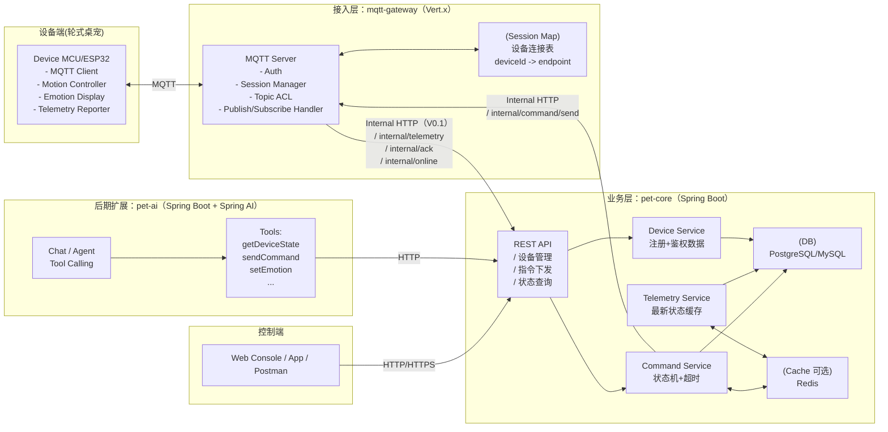
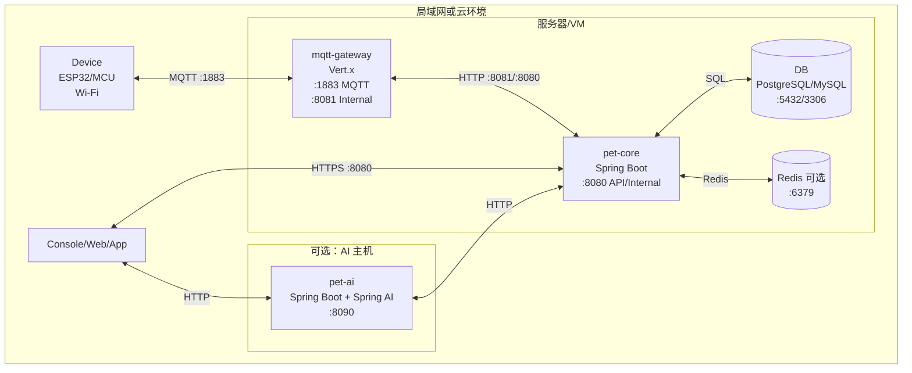
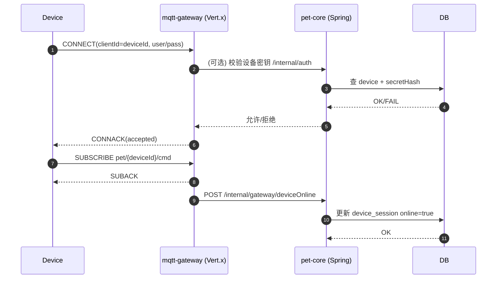
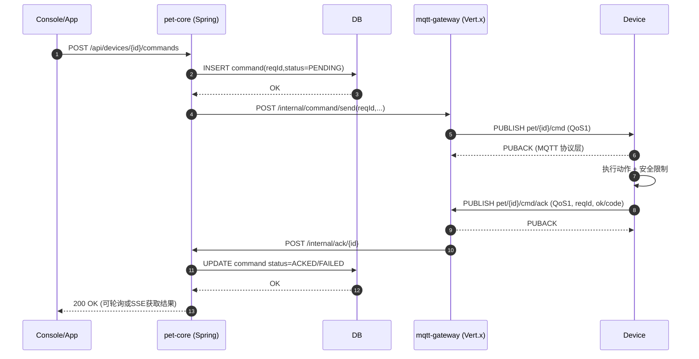
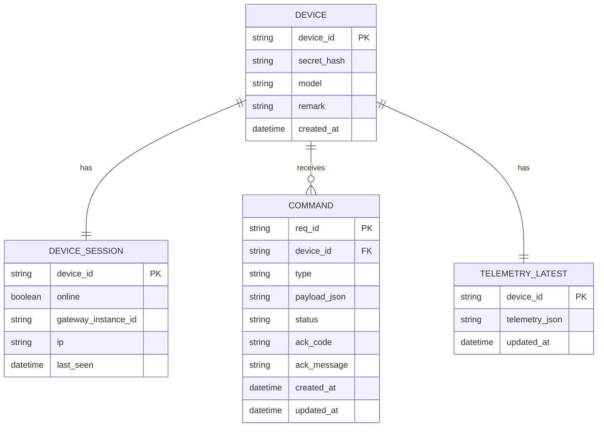

下面我直接给你一份“**完整架构图 + 完整开发文档（可直接落到仓库 docs/）**”。整体按 **V0.1 MVP** 设计：先跑通闭环，不上来就复杂，但所有关键扩展点（多实例、消息队列、AI）都已经在架构里预留。

你可以把下面两段内容分别存成：

* `docs/ARCHITECTURE.md`（架构图+说明）
* `docs/DEVELOPMENT.md`（开发文档：接口、协议、数据、实现细则、测试与部署）

---

# ARCHITECTURE.md（完整架构图）

## 1. 总览架构图（组件视角）

> **说明**：V0.1 采用“Vert.x MQTT 网关 + Spring Boot Core”，网关负责连接/协议，Core 负责业务/数据。AI（Spring AI）作为后续独立服务插入，不影响 MVP。



---

## 2. 部署架构图（运行与端口）



> V0.1 你可以把 `mqtt-gateway` 和 `pet-core` 放同一台机器上，内部接口走内网端口，先不考虑复杂网络。

---

## 3. 数据流图（上行/下行）

```mermaid
flowchart LR
  D[Device] -->|telemetry\npet\{id}/telemetry| G[mqtt-gateway]
  G -->|POST /internal/telemetry/{id}| C[pet-core]
  C -->|UPSERT latest + append history| DB[(DB/TSDB)]

  C -->|POST /internal/command/send| G
  G -->|cmd QoS1\npet/{id}/cmd| D
  D -->|cmd/ack QoS1\npet/{id}/cmd/ack| G
  G -->|POST /internal/ack/{id}| C
  C -->|update command status| DB
```

---

## 4. 核心时序图（连接上线）



---

## 5. 核心时序图（命令下发与回执闭环）



---

## 6. 数据模型图（ER）



---
